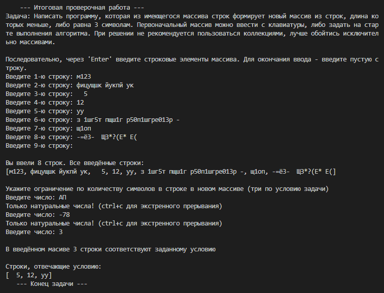

# Итоговая проверочная работа

## Описание условия задачи от GeekBrains
> Данная работа необходима для проверки ваших знаний и навыков по итогу прохождения первого блока обучения на программе Разработчик. Мы должны убедится, что базовое знакомство с IT прошло успешно.
> 
> Задача алгоритмически не самая сложная, однако для полноценного выполнения проверочной работы необходимо:
> 
> 1. Создать репозиторий на GitHub
> 2. Нарисовать блок-схему алгоритма (можно обойтись блок-схемой основной содержательной части, если вы выделяете её в отдельный метод)
> 3. Снабдить репозиторий оформленным текстовым описанием решения (файл README.md)
> 4. Написать программу, решающую поставленную задачу
> 5. Использовать контроль версий в работе над этим небольшим проектом (не должно быть так, что всё залито одним коммитом, как минимум этапы 2, 3, и 4 должны быть расположены в разных коммитах)
> 
> **Задача:** Написать программу, которая из имеющегося массива строк формирует новый массив из строк, длина которых меньше, либо равна 3 символам. Первоначальный массив можно ввести с клавиатуры, либо задать на старте выполнения алгоритма. При решении не рекомендуется пользоваться коллекциями, лучше обойтись исключительно массивами.
> 
> **Примеры:**
> 
> [“Hello”, “2”, “world”, “:-)”] → [“2”, “:-)”]
> 
> [“1234”, “1567”, “-2”, “computer science”] → [“-2”]
> 
> [“Russia”, “Denmark”, “Kazan”] → []

---

## Решение задачи

Задача решена на языке `C#` с выводом решения в консоль. Задача решена для "общего случая", когда пользователь вводит в консоль строковые элементы, при этом программа не знает заранее количество вводимых элементов. Сигнал к завершению ввода строк - ввод пустой строки (нажатие клавиши **Enter** при очередном вводе), после чего в консоли отображается весь массив элементов. Следующим этапом пользователь вводит число. В новый массив попадут только те строки, длина которых меньше этого числа. При вводе числа реализована проверка, допускающая только натуральные числа, то есть целые и больше нуля. При любом другом вводе, будет предложено попробовать ещё раз. После этого в консоль выводится количество элементов, удовлетворяющих условию, а так же новый массив, состоящий только из этих элементов.

Поскольку в условии задачи рекомендовалось не использовать множества, было реализовано что-то типа динамического массива с использованием массива массивов. Основная программа, с использованием множества, тоже могла бы быть меньше, т.к. в данном решении сначала находится общая длина нового массива пробежкой по изначальному массиву, создаётся новый массив и заполняется повторной пробежкой по изначальному массив. 

Ниже представлена блок-схема основного алгоритма.

При решении задачи использованы некоторые функции, разработанные в ходе курса _Введение в языки программирования_. 

Так, рекурсивная функция `InputChecker()` - это блок `try-catch` для защиты от ввода не-чисел. Функция `EndingChanger()` подставляет окончания словам в зависимости от наклонения числительного: одна строк`а`, две строк`и`, пять строк. 

Вывод решения визуально отличается от описанного в условии задачи, т.к. не было требования по соответствию.

Ниже представлен скриншот варианта решения задачи.
> 
